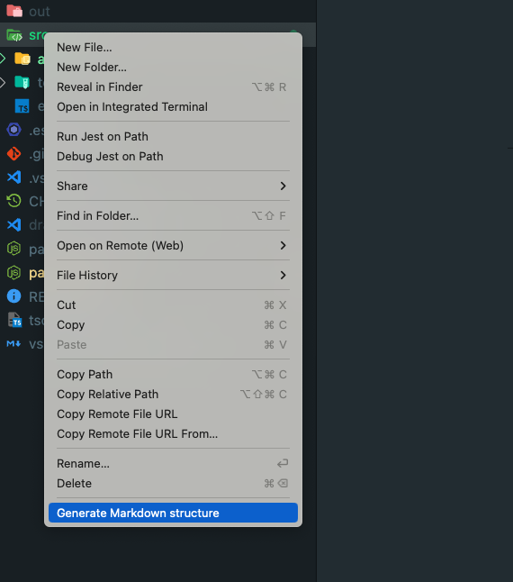
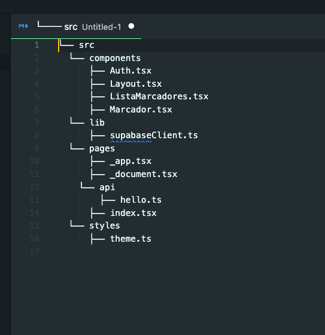
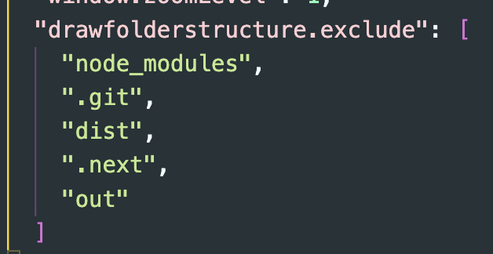
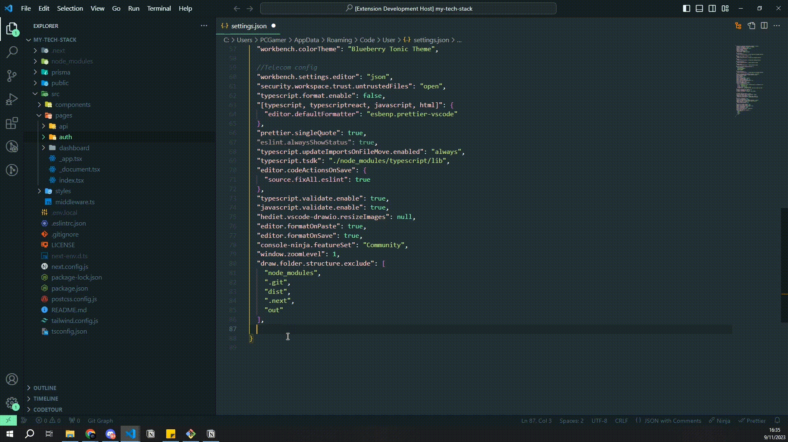

# Markdown Folder Structure for VS Code


A Visual Studio Code extension that allows users to generate a visual representation in Markdown of the selected folder and file structure.
This extension works with vscode version 1.81.0 or higher

## Features

```
└── 📁src
    └── 📁[components](./src/components/)
        └── [navbar.tsx](./src/components/navbar.tsx)
    └── [middleware.ts](./src/middleware.ts)
    └── 📁[pages](./src/pages/)
        └── 📁[api](./src/pages/api/)
            └── 📁[auth](./src/pages/api/auth/)
            └── [hello.ts](./src/pages/api/hello.ts)
        └── 📁[auth](./src/pages/auth/)
            └── [login.tsx](./src/pages/auth/login.tsx)
        └── 📁[dashboard](./src/pages/dashboard/)
            └── [index.tsx](./src/pages/dashboard/index.tsx)
        └── [index.tsx](./src/pages/index.tsx)
        └── [_app.tsx](./src/pages/_app.tsx)
        └── [_document.tsx](./src/pages/_document.tsx)
    └── 📁[styles](./src/styles/)
        └── [globals.css](./src/styles/globals.css)
```

- **Quick Generation**: With a single click, get a Markdown representation of your folder structure.
- **Attractive Format**: Choose from many designs! The generated structure uses Unicode characters for a clear and aesthetic display.
- **Seamless Integration**: Integrates directly into the VS Code file explorer context menu.

## Usage

1. Navigate to the file explorer in VS Code.
2. Right-click on a folder or file.
3. Select "Generate Markdown structure" from the context menu.
4. Enjoy your folder structure in Markdown format!

## Screenshots



_Click on the option "Generate Markdown structure"._



_A file with the drawing of the structure will be generated._

## Customization

You can customize which folders and files to exclude in the drawing, as well as choose from many markdown layouts.

##### Exclude folders or files as you like

For example: "node_module" (Excluded by default).
Just add in your **settings.json** file the line **"draw.folder.structure.exclude"** and it will show you the default excluded folders and files.
You can modify it to your liking!



#### Choose the design you like best

Choose from a lot of predefined designs we have to offer. By default we use "ClassicDashes".

list of styles:

- ClassicDashes
- SparklesDesing
- TrailDesign
- FloralDesign
- GalacticDesign
- MinimalistDots
- EmojiFun
- EmojiMinimalist
- Arrows
- NestedCircles
- BoldBlocks
- SlashSeparators
- ChevronIndicators
- DotDashMix
- Triangles
- Zigzag
- PipesAndHyphens
- NestedSquares
- CirclesAndLines



## Installation

1. Open Visual Studio Code.
2. Go to the Extensions view or press `Ctrl+Shift+X`.
3. Search for "Markdown Folder Structure".
4. Install and you're done!

## Contributions

Contributions are welcome. If you encounter any problems or have any suggestions, please open an issue in the GitHub repository. We also invite you to read [How to contribute](./CONTRIBUTING.md)

## Made by

**Krivoox**
[Follow me on X](https://twitter.com/jkrivoox)
[My linkedin](https://www.linkedin.com/in/juan-manuel-krivocapich/)

## License

[MIT](./LICENSE.md)
